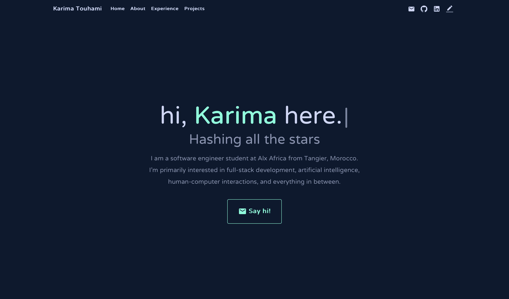

<p align="center">
  
</p>
<h1 align="center">
  Karima - v1
</h1>
<p align="center">
  The first iteration of <a href="https://karimatouhami.github.io">KarimaTouhami</a> built with React.js leveraging Material UI.
</p>



## Introduction
Karima is a personal project built with React.js and Material UI. This project serves as a portfolio and a demonstration of my skills in web development, particularly using modern JavaScript frameworks and libraries.

- **Deployed Site**: [KarimaTouhami](https://karimatouhami.github.io)
- **Final Project Blog Article**: [My portfolio: Karima Touhami](https://medium.com/@karimatouhami/my-portfolio-karima-touhami-f7de79e32add)
- **Author's LinkedIn**: [Karima Touhami](https://www.linkedin.com/in/karimatouhami)

## Installation

To set up the project locally, follow these steps:

1. Clone the repository
   ```sh
   git clone https://github.com/KarimaTouhami/KarimaTouhami.github.io.git
   cd KarimaTouhami.github.io
   ```

2. Install the dependencies
   ```sh
   npm install
   # or
   yarn
   ```

3. Start the development server
   ```sh
   npm run start
   # or
   yarn run start
   ```

## Usage

Once the development server is running, you can access the project at `http://localhost:3000`.

## Build and Run for Production

To generate a full static production build:

1. Generate the build
   ```sh
   npm run build
   # or
   yarn run build
   ```

2. Serve the build locally (optional)
   ```sh
   npx serve -s build
   ```

## Contributing

Contributions are welcome! Please fork this repository and submit pull requests.

1. Fork the Project
2. Create your Feature Branch (`git checkout -b feature/AmazingFeature`)
3. Commit your Changes (`git commit -m 'Add some AmazingFeature'`)
4. Push to the Branch (`git push origin feature/AmazingFeature`)
5. Open a Pull Request

## Related Projects

Here are some related projects that might interest you:

- [React](https://reactjs.org/)
- [Material UI](https://material-ui.com/)
- [Three.js](https://threejs.org/)

## Licensing

This project is licensed under the MIT License. See the [LICENSE](LICENSE) file for more information.

## 🎨 Color Codes

| Color          | Hex                                                                |
| -------------- | ------------------------------------------------------------------ |
| Navy           |  `#0a192f` |
| Light Navy     |  `#112240` |
| Lightest Navy  |  `#233554` |
| Slate          |  `#8892b0` |
| Light Slate    |  `#a8b2d1` |
| Lightest Slate |  `#ccd6f6` |
| White          |  `#e6f1ff` |
| Green          |  `#64ffda` |

